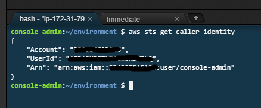
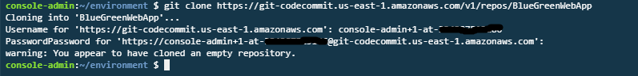
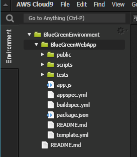
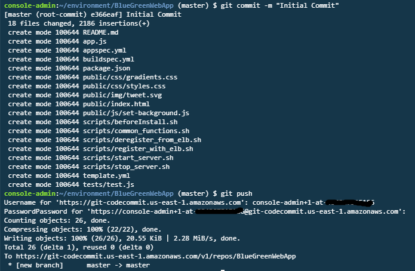

# Detail Instructions

## Create Cloud9 environment

AWS Cloud9 is a cloud-based integrated development environment (IDE) that lets you write, run, and debug your code with just a browser. It includes a code editor, debugger, and terminal. Cloud9 comes prepackaged with essential tools for popular programming languages, including JavaScript, Python, PHP, and more, so you don’t need to install files or configure your development machine to start new projects. Since your Cloud9 IDE is cloud-based, you can work on your projects from your office, home, or anywhere using an internet-connected machine. Cloud9 also provides a seamless experience for developing serverless applications enabling you to easily define resources, debug, and switch between local and remote execution of serverless applications. With Cloud9, you can quickly share your development environment with your team, enabling you to pair program and track each other's inputs in real time.

###  Step-by-step Instructions**

1. Sign into the AWS Management Console https://console.aws.amazon.com/.

Note: For this lab you will need to use an IAM user and not a federated user account or root account. See the [Prerequisites](./Prerequisites.md)

1. Go to the AWS Management Console, click **Services** then select **Cloud9** under Developer Tools.
2. Click **Create environment**.
3. Enter `BlueGreenEnvironment` into **Name** and optionally provide a **Description**.
4. Click **Next step**.
5. You may leave **Environment settings** at their defaults of launching a new **t2.micro** EC2 instance which will be paused after **30 minutes** of inactivity.
6. Click **Next step**.
7. Review the environment settings and click **Create environment**. It will take several minutes for your environment to be provisioned and prepared.
8. Once ready, your IDE will open to a welcome screen. Below that, you should see a terminal prompt similar to:  You can run AWS CLI commands in here just like you would on your local computer. Verify that your user is logged in by running `aws sts get-caller-identity`.



We will be using Cloud9 IDE for our development. 

## Create an AWS CodeCommit Repository

1. Open the AWS CodeCommit console at <https://console.aws.amazon.com/codecommit>.
2. In the region selector, choose the region where you will create the repository. For more information, see [Regions and Git Connection Endpoints](http://docs.aws.amazon.com/codecommit/latest/userguide/regions.html).
3. On the Welcome page, choose Get Started Now. (If a **_Dashboard_** page appears instead, choose **_Create repository_**.)
4. On the **Create repository** page, in the **Repository name** box, type **_BlueGreenWebApp_**.
5. In the **Description_* box, type **_BlueGreenWebApp repository_**.
6. Click **Create repository** to create an empty AWS CodeCommit repository named **_BlueGreenWebApp_**.
7. On the successful screen of creating **_BlueGreenWebApp_**, review Connection steps. In the step 3, click Copy to copy the Clone command.
8. Go to your Cloud9 IDE you created in the previous step.  In the terminal prompt paste clone command you previouly copied. Enter Username and Password of your Git Credential.



9. Configure Git user in Cloud9 environment.

```console
user:~/environment $ git config --global user.email you@example.com
user:~/environment $ git config --global user.name "Your Name"
user:~/environment $ cd BlueGreenWebApp
user:~/environment $ git config credential.helper store
```

10. Inside BlueGreenWebApp folder, download the Sample Web App Archive by running the following command from IDE terminal and unzip the archvie.

```console
user:~/environment $ wget https://github.com/sirirako/AWSCICDWorkShop/raw/master/WebApp.zip
user:~/environment $ unzip WebApp.zip
user:~/environment $ rm WebApp.zip
```
Your IDE environment should look like this.



11. Stage your change by running **_git add_**. You can use **_git status_** to review the change.

```console
user:~/environment/BlueGreenEnvironment/ $ git add *
user:~/environment/BlueGreenEnvironment/ $ git status
```

12.  Commit your change by running **_git commit_** to commit the change to the local repository then run **_git push_** to push your commit the default remote name Git uses for your AWS CodeCommit repository (origin). Enter your git credential.

```console
user:~/environment/BlueGreenEnvironment/ $ git commit -m "Initial Commit"
user:~/environment/BlueGreenEnvironment/ $ git push
```


**_💡 Tip_** After you have pushed files to your AWS CodeCommit repository, you can use the AWS CodeCommit console to view the contents. For more information, see [Browse the Contents of a Repository](http://docs.aws.amazon.com/codecommit/latest/userguide/how-to-browse.html).

## Create Infrastructure

In this step, we will be using CloudFormation template to create infrstructure used for this lab.  Review template.yml.

1. In Cloud9, create CloudFormation stack by running this command.

```console
user:~/environment/BlueGreenEnvironment/ $ aws cloudformation create-stack --stack-name BlueGreenEnvironment --template-body file://template.yml --capabilities CAPABILITY_IAM
```


## Clean up Instruction

1. Go to EC2 Console and navigate to Auto Scaling Groups. Select CodeDeploy_dev314_d-XXXXXXXXX, click Actions and select Delete.
2. Go to CloudFormation console, select bgcicd or the stackname that you created. Click Actions and select Delete Stack.
3. Go to CodeBuild, CodeDeploy and CodePipeline console.  Delete the resource that you have created.
