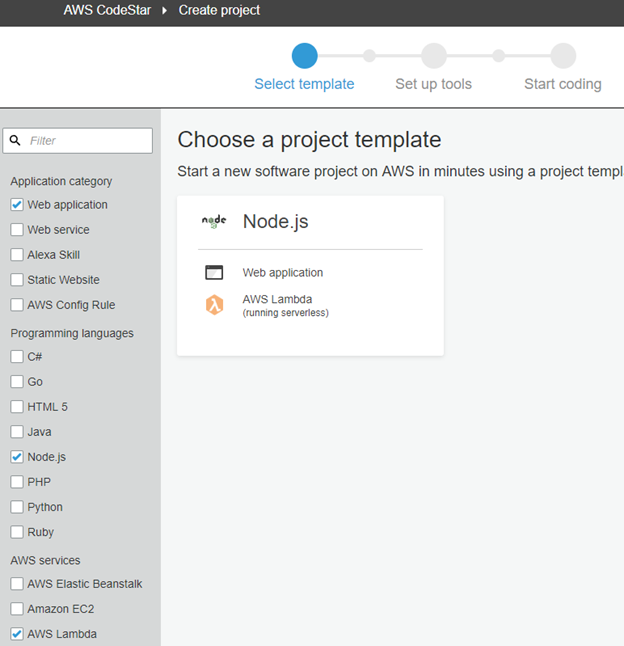
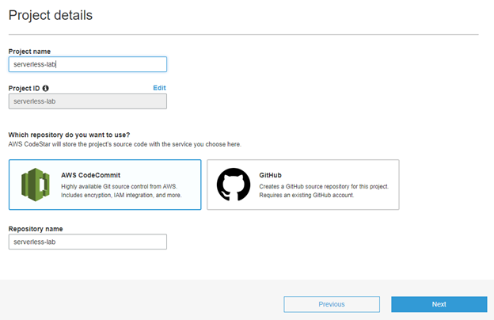
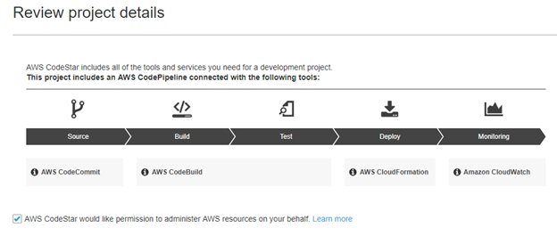
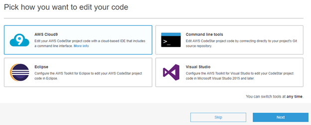
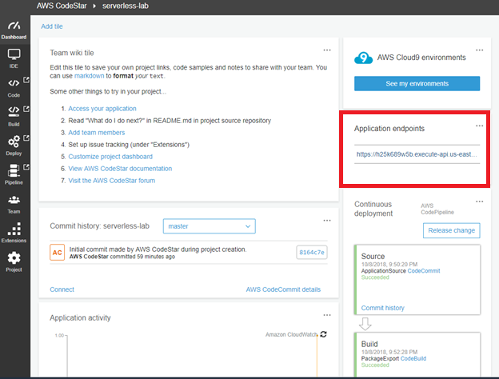

# Building a Serverless App using CodeStar
What we are building to is a Lambda Function with API Gateway.  We will be using AWS CodeStar to build this project. CodeStar will using AWS Cloud9, AWS CodeCommit, AWS CodeBuild, AWS Cloudformation and AWS SAM. We will be learning about
- Using CodeStar to start a project.
- Using Cloud9 IDE for development and debugging.
- Build a simple Lambda application.
- Add X-Ray to your Lambda project


# Before you begin 
1. AWS Account

# Detailed Instructions
## Create a CodeStar project
1. Log in to your AWS Account using your IAM user.
2. Go to CodeStar and click create a new project.  On the left bar filter the project  with Web Application, Node.js and AWSLambda for Application category, Programming languages and AWS service. 



3. Enter the project details:

Project name: serverless-lab.
Which repository do you want to use? AWS CodeCommit.

Click Next.



Review the project details and click create a project.



4. Pick the IDE and today we will be using AWS Cloud 9.



Select t2.micro for FREE TIER.  It takes a few minutes to provision a Cloud9 Instance.

5. Navigate to your newly created project in CodeStar and locate the Application endpoint. 



Click the enpdpoint and you should see the new Node.js web application that we just created.

## Using Cloud9 for developing

5. In CodeStar, click IDE on the left side. Click serverless-lab Cloud9 environment. It takes a few minute to star the IDE.

6. On the left side, open template.yml.  Add the code below under Resources section.

```

AddService:
  Type: AWS::Serverless::Function
  Properties:
    Handler: filename.handler-function
    Runtime: nodejs6.10
    Role:
      Fn::ImportValue:
        !Join ['-', [!Ref 'ProjectId', !Ref 'AWS::Region', 'LambdaTrustRole']]
    Events:
      GetEvent:
        Type: Api
        Properties:
          Path: /path/{x}/{y}
          Method: any

```

