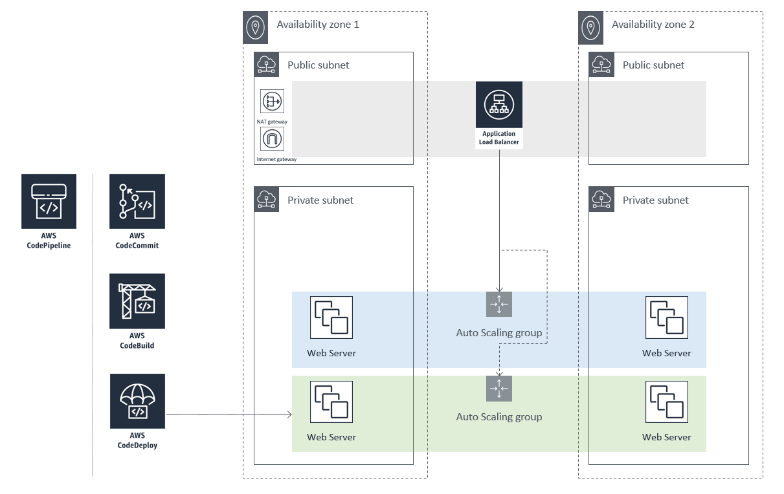

# CICD with CodePipeline and Blue Green Deployment

Blue-Green is a deployment technique that keep 2 production environments running but only one of the environment is live and one is idle. As you prepare a new version of your software, the current production (Blue) is servering all production traffic. You also have another environment running the new software. Once it has been fully tested (Green), you switch the traffic to route to the Green environment instead of Blue. Now Green is live and Blue is idle.

This technique can reduce the downtime and risks. If there is unexpected issues with Green then you can switch the traffic back to Blue.

## What we will be doing in this lab

# Overall steps:

1. Create Cloud9 environment.
2. Create a repository for your code and commit you first code.
3. Create infrastructure (ALB, ASG, EC2 and S3).
4. Create Build project with CodeBuild and store build artifact in S3.
5. Create Application and Deployment group to deploy the artifact to AutoScaling Group with Blue Green deployment.
6. Create CICD with CodePipeline

For Prerequisites, go [here](Prerequisites.md).

Follow the Detail Instruction [here](Detail_Instructions.md).

Resources:

